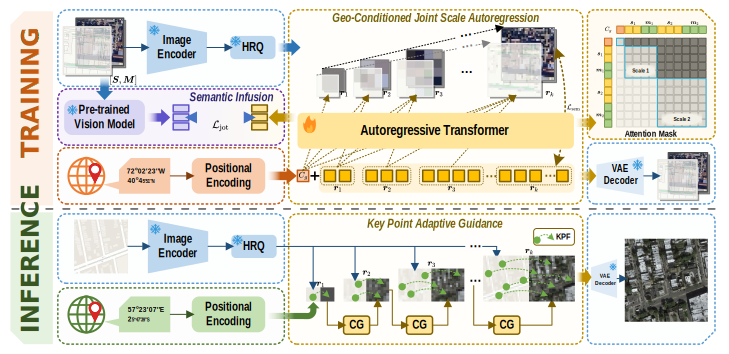

#  EarthMapper: Visual Autoregressive Models for Controllable Bidirectional Satellite–Map Translation


[Zhe Dong](https://scholar.google.com/citations?user=6ygNEFsAAAAJ&hl=zh-CN) , Yuzhe Sun, [Tianzhu Liu](https://www.researchgate.net/profile/Tianzhu-Liu-3) , Wangmeng Zuo, [Yanfeng Gu](https://scholar.google.com/citations?user=WHkRZscAAAAJ&hl=zh-TW&oi=ao) 

**Harbin Institute of Technology**

---

## 📢  Latest Updates 

[//]: # (- **Feb-26-2025**: 📂 GeoPixelD dataset is released on **_HuggingFace_** [MBZUAI/GeoPixelD]&#40;https://huggingface.co/datasets/MBZUAI/GeoPixelD&#41;)

[//]: # (- **Feb-20-2025**: 🚀 GeoPixel training and finetuning code is released. )

[//]: # (- **Feb-20-2025**: 🔥 Our model checkpoints are released on **_HuggingFace_** [link]&#40;https://huggingface.co/collections/MBZUAI/geopixel-67b6e1e441250814d06f2043&#41;. )
- **Apr-27-2025**: 📜 The EarthMapper paper is released [arxiv link](https://arxiv.org/abs/2501.13925).

[//]: # (- 👉 [Get Started with GeoPixel]&#40;https://github.com/mbzuai-oryx/GeoPixel/blob/main/README.md#%EF%B8%8F-usage&#41;)

[//]: # ([//]: # &#40;  &#41;)
[//]: # (---)

##  EarthMapper Overview  
EarthMapper is a novel autoregressive framework for controllable bidirectional satellite–map translation, seamlessly integrating geographic coordinate embeddings with multi-scale feature alignment to achieve region-adaptive, high-fidelity generation. It unifies bidirectional synthesis via a geo-conditioned joint scale autoregression process, enhanced by semantic infusion and key point adaptive guidance for superior visual realism, semantic consistency, and structural coherence.

<p align="center">
  
</p>

---
## 🏆 Contributions  
- We construct CNSatMap, the first large-scale, high-precision dataset for BSMT, enabling rigorous exploration of cross-modal geographic translation and fostering advancements in urban analytics and automated cartography.
- We propose EarthMapper, a  AR-based generative framework that unifies GJSA process via multi-scale alignment, achieving superior generative capability and versatility.
- The SI mechanism is designed to enforce feature-level consistency between generated and real images, enhancing semantic fidelity in weakly aligned satellite-map pairs.
- We introduce KPAG, which intelligently balances diversity and accuracy through key-point anchoring and dynamic complexity modulation, ensuring cartographic precision while preserving realism.

[//]: # (---)

[//]: # (## ⚙️ Requirements)

[//]: # ()
[//]: # (- python 3.10 and above)

[//]: # (- pytorch >= 2.3.1, torchvision >= 0.18.1 are recommended)

[//]: # (- CUDA 11.8 and above is recommended &#40;Please follow the instructions [here]&#40;https://pytorch.org/get-started/locally/&#41; to install both PyTorch and TorchVision dependencies&#41;)

[//]: # (- [flash-attention2]&#40;https://github.com/Dao-AILab/flash-attention&#41; is required for high-resolution usage)

[//]: # (  <br>)

[//]: # ()
[//]: # (---)

[//]: # (## 🛠️ Usage)

[//]: # (Follow the guidelines below to set up and use GeoPixel efficiently:)

[//]: # (- [GeoPixelD data]&#40;./docs/dataset.md&#41;:📌 This section provides instructions on how to access and prepare the GeoPixelD dataset)

[//]: # (- [Installation Guidelines]&#40;./docs/install.md&#41; :⚙️ This section includes step-by-step instructions on setting up the necessary dependencies, installing required libraries, and configuring your environment for running GeoPixel.)

[//]: # (- [Training and Finetuning]&#40;./docs/finetune.md&#41; :🚀 This guide explains how to train the GeoPixel model from scratch or fine-tune a pre-trained version for downstream remote sensing tasks.)

[//]: # (- [Inference Guide]&#40;./docs/inference.md&#41;: 🔍 This section describes how to use a trained GeoPixel model for making predictions, running inference on images and generating segmentation masks.)

[//]: # ()
[//]: # (---)

<!-- CNSatMap Dataset -->
## 🛠️ CNSatMap

<p align="center">
  
</p>

CNSatMap is the first large-scale, high-precision dataset for bidirectional satellite–map translation, comprising 302,132 meticulously aligned satellite-map pairs across 38 diverse Chinese cities to enable robust cross-modal geospatial research.

[//]: # (---)

[//]: # (## 🏷️ Annotation Pipeline)

---
## 🔍 Map-to-Satellite Translation

<p align="center">
  
</p>

---
## 🔍 Satellite-to-Map Translation

<p align="center">
  
</p>

---

## 🔍 In-painting & Out-painting

<p align="center">
  
</p>

## 📜 Citation 

```bibtex
@article{dong2025earthmapper,

}
```

[//]: # (---)

[//]: # (## 🙏 Acknowledgement )

[//]: # (We appreciate InternLM-XComposer &#40;IXC&#41;, GlaMM, and LISA for making their models and code available as open-source contributions.)

[//]: # ()
[//]: # (---)

[//]: # ()
[//]: # ([]&#40;https://www.ival-mbzuai.com&#41;)

[//]: # ([]&#40;https://github.com/mbzuai-oryx&#41;)

[//]: # ([]&#40;https://mbzuai.ac.ae&#41;)
