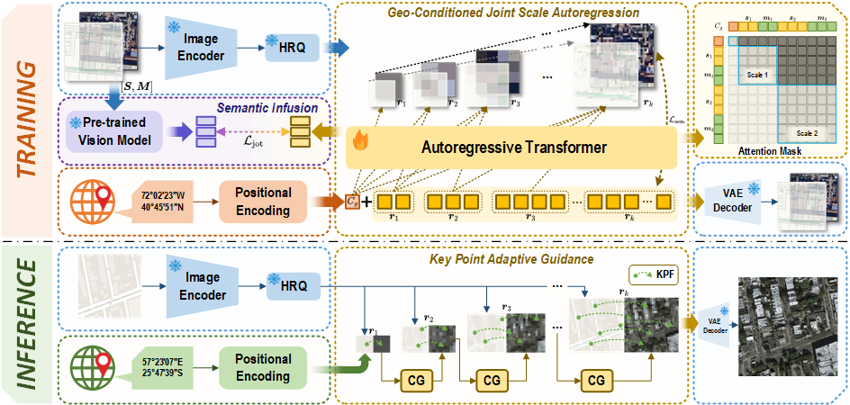
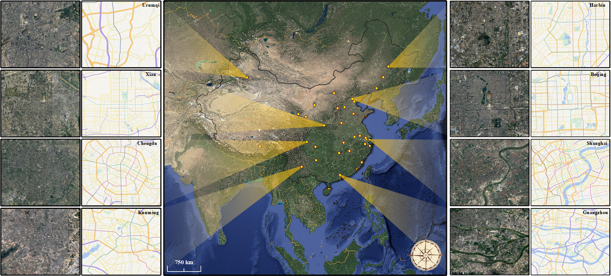

#  EarthMapper: Visual Autoregressive Models for Controllable Bidirectional Satellite–Map Translation


[Zhe Dong](https://scholar.google.com/citations?user=6ygNEFsAAAAJ&hl=zh-CN) , Yuzhe Sun, [Tianzhu Liu](https://www.researchgate.net/profile/Tianzhu-Liu-3) , Wangmeng Zuo, [Yanfeng Gu](https://scholar.google.com/citations?user=WHkRZscAAAAJ&hl=zh-TW&oi=ao) 

**Harbin Institute of Technology**

---

## 📢  Latest Updates 

[//]: # (- **Feb-20-2025**: 🔥 Our model checkpoints are released on **_HuggingFace_** [link]&#40;https://huggingface.co/collections/MBZUAI/geopixel-67b6e1e441250814d06f2043&#41;. )
- **Apr-27-2025**: 📜 The EarthMapper paper is released at [arxiv link](https://arxiv.org/abs/2501.13925).

[//]: # (🔥🚀📂)

##  EarthMapper Overview  
EarthMapper is a novel autoregressive framework for controllable bidirectional satellite–map translation, seamlessly integrating geographic coordinate embeddings with multi-scale feature alignment to achieve region-adaptive, high-fidelity generation. It unifies bidirectional synthesis via a geo-conditioned joint scale autoregression process, enhanced by semantic infusion and key point adaptive guidance for superior visual realism, semantic consistency, and structural coherence.

<p align="center">
  
</p>
---
## 🏆 Contributions  
- We construct CNSatMap, the first large-scale, high-precision dataset for BSMT, enabling rigorous exploration of cross-modal geographic translation and fostering advancements in urban analytics and automated cartography.
- We propose EarthMapper, a  AR-based generative framework that unifies GJSA process via multi-scale alignment, achieving superior generative capability and versatility.
- The SI mechanism is designed to enforce feature-level consistency between generated and real images, enhancing semantic fidelity in weakly aligned satellite-map pairs.
- We introduce KPAG, which intelligently balances diversity and accuracy through key-point anchoring and dynamic complexity modulation, ensuring cartographic precision while preserving realism.

<!-- CNSatMap Dataset -->
## 🛠️ CNSatMap

<p align="center">
  
</p>

CNSatMap is the first large-scale, high-precision dataset for bidirectional satellite–map translation, comprising 302,132 meticulously aligned satellite-map pairs across 38 diverse Chinese cities to enable robust cross-modal geospatial research.

---
## 🔍 Map-to-Satellite Translation

<p align="center">
  
</p>

---
## 🔍 Satellite-to-Map Translation

<p align="center">
  
</p>

---

## 🔍 In-painting & Out-painting

<p align="center">
  
</p>

## 📜 Citation 

```bibtex
@article{dong2025earthmapper,

}
```
